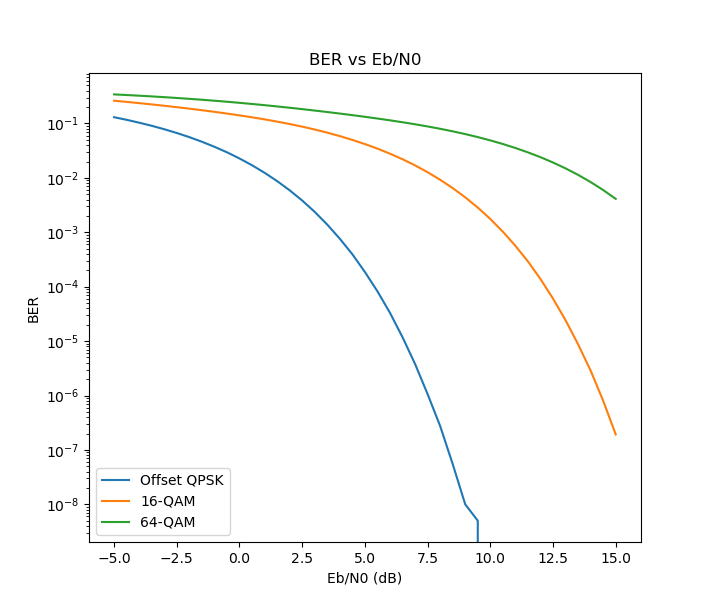
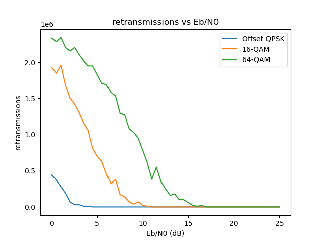
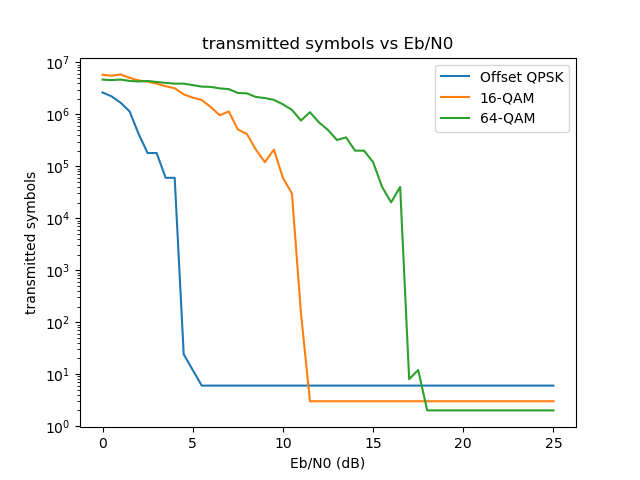
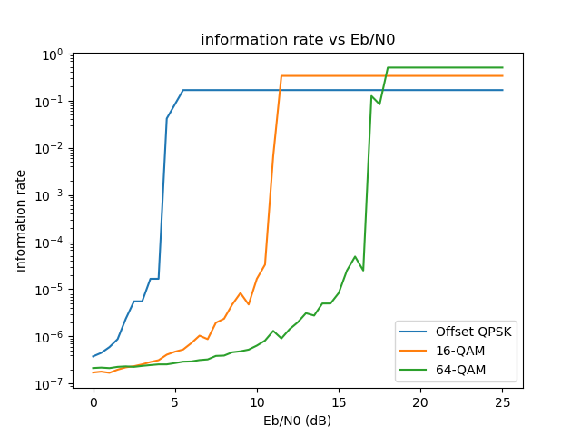

### Experiment for Wireless Communication Case Study
#### (Comparison between different digital modulation methods)
------
__Author: Benteng Ma__
Dec.1st, 2021

#### Introduction
We tested three digital modulation methods, which are offset-QPSK, 16-QAM and 64-QAM, commonly used in several wireless communication protocols. We first analysed their bit error rates under different bit energy to noise rates; then organized a rase between the three on transmitting a same bit length of message under different values of transmitting power, to test their transmission efficiency.

#### Bit Error Rate Simulation
This is quite similar to our in-class assignment for Digital Communication, where we simulated an 8-Ary and a 16-QAM digital modulations with MATLAB to test for bit error rate (BER) under different bit energy to noise rates (Eb/N0). We rewrite the simulation procedure within python which supports simulation of QAMs with symbols in a square. The modulation procedure begins by simply running the script qam_simulation.py. The output should look like:

#### Evaluation on transmission efficiency
We designed a simulation with 256 frames, each containing 12 bits' information. Using 12 bits is because it is the least common multiple of 2, 4 and 6, bits per symbol for offset-QASK, 16 and 64-QAM. Larger frame can be more similar to reality, but our test already gives strong results to support our opinion that, larger value of M for M-ary modulation can only be more efficient with sufficient SNR.

During the test, the system must finish sending all the frames, for each frame, the receiver is able to detect the error but unable to correct it. Once an error is discovered, the whole frame will be retransmitted.

We analysed whole retransmission times, total transmitted symbols for a the whole message, and an "information rate" computed by taking the reciprocal of total transmitted symbols. For information rate, we mean the rate of quantity of information can actually be transmitted under the same bound rate. __For retransmissions over 250 for one frame, we treat it as failure and add 10000 to the counted value to distinguish from frames that are transmitted successfully but have several times of retransmission.__

Running the script qam_retransmission_simulation.py, the results of the above will be displayed.

We can see that Offset-QPSK takes the least times of retransmission under relatively small Eb/N0 values, yet the 64-QAM experiences a lot of failures.

Offset-QPSK also takes the least symbols to transmit before 11 dB Eb/N0, and 64-QAM only begins to take less symbols at over 17 dB.

The result can be more obvious looking at the reciprocal.

#### Conclusion
We can see that under the same symbol rate in transmission, a simpler modulation strategy actually results in better efficiency. It takes much more energy for achieving a little improvement on bandwidth if transmitting under the same signal frequency. We've learnt that in 5G, 128-QAM is also used, and according to our result, it will be much less energy efficient. Especially considering the fact that the signal frequency also increases, which result in a more significant power fading.

Since complex digital modulation performs non-ideally in power consumption, simple modulation strategy can be much more satisfactory in cases that power consumption is more critical than bandwidth, such as a lot of IoT applications. This shows the reason that protocols with power-saving trends such as ZigBee are more welcome in IoT networks.

#### Future Work
It is a pity that we do not have more time to also investigate the performance of the above under error correction coded frames. It is predictable that the performance of the above modulations in reality can be better because of the powerful error correction strategies. We would like to leave them as our future work.
